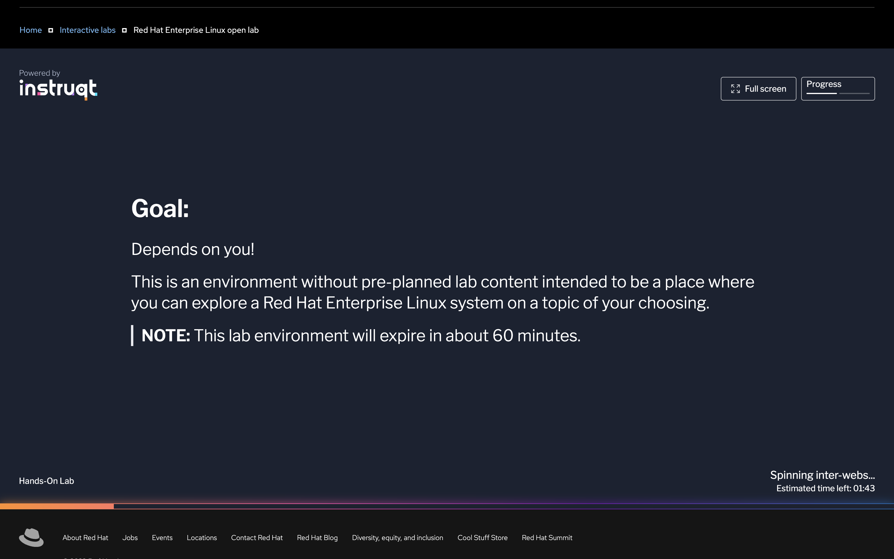
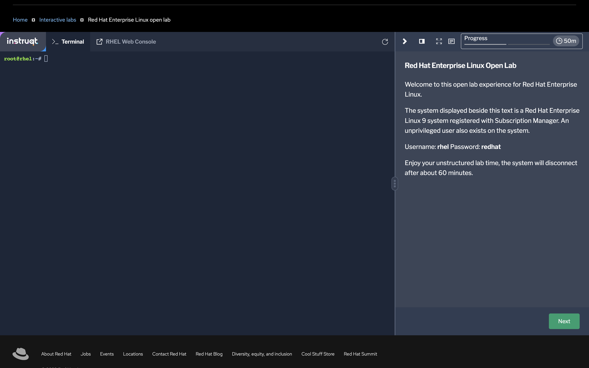
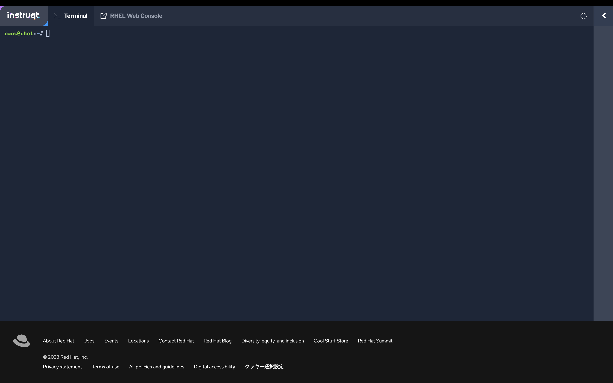

# 開始方法

## ハンズオンの構成

本ハンズオンは、ドキュメント（本サイト）と実行環境（Red Hat Enterprise Linux open lab）から構成されるコンテンツです。

- ドキュメント: [Podmanハンズオン:ドキュメント](https://tnk4on.github.io/podman-handson)
- 実行環境: [Red Hat Enterprise Linux open lab](https://www.redhat.com/en/interactive-labs/red-hat-enterprise-linux-open-lab)

使用するブラウザで2つのページを開き、ドキュメントを参照しながら実行環境にコマンドを入力する体験型の学習コンテンツです。


### ドキュメントの進め方
赤の枠の部分が1コンテンツの範囲です。実行する内容とコマンド例の紹介に続いて、コピペ用のコマンド例があります。「:fontawesome-regular-paste:アイコン」を押すとクリップボードにコマンドがコピーされますので、OpenLabのターミナル画面でコマンドをペーストできます。
「出力結果」の:fontawesome-solid-angle-right:アイコンを押すとコマンド結果が展開されます。自身のコマンド入力の結果と比べてみてください。
//// html | div[style='border: 1px solid red;padding: 5px;']
`podman run`コマンドを実行し、`ubi8/httpd-24` イメージをプルして実行します
```
$ podman run -ti --rm registry.access.redhat.com/ubi8/httpd-24 bash
```

(コピペ用)
``` { .yaml .copy } 
podman run -ti --rm registry.access.redhat.com/ubi8/httpd-24 bash
```

/// details | 出力結果
    type: success
```
$ podman run -ti --rm registry.access.redhat.com/ubi8/httpd-24 bash
Trying to pull registry.access.redhat.com/ubi8/httpd-24:latest...
Getting image source signatures
Checking if image destination supports signatures
Copying blob 9ece777c9660 done  
Copying blob 70de3d8fc2c6 done  
Copying blob b653248f5bcb done  
Copying config c4127096ce done  
Writing manifest to image destination
Storing signatures
bash-4.4$ 
```
///
////

- コマンドが複数行ありコピペ部分が複数に分かれている場合は、1つずつ順に実行していきます

### プロンプトの表記について

プロンプトは実際には下記のようになっています
``` title="ラボ環境起動直後のプロンプト表示"
root@rhel:~# 
```
ハンズオンコンテンツ上ではプロンプト記号以外は省略して表記します。

``` title="ルートモードで実行する場合の表記"
#
```

``` title="ルートレスモードで実行する場合の表記"
$
```


### コンテナレジストリへログインが必要な設問について

本書のコマンド例にはコンテナレジストリ（quay.io）へのログインが必要な箇所がいくつかあります。

### どれから始めるか

まずは基本のコマンドを学ぶChapter 2から。
すでにDockerの経験があれば、4,6,7
上級者なら10,11

### その他、本書との差分

- コンテンツの中には「オプション問題」があります。
- ユーザー名はハンズオン環境に合わせて変更しています（本書で/home/dwalshとなっている部分）
- ハンズオンとしては習得効果が薄い内容については省略している部分もあります

## ハンズオン環境の起動
Labsの起動方法



起動後

60分間使用できます。60分経過後は再度ラボ環境を起動してください。その際、前回のデータは引き継がれませんのでご注意ください。


:fontawesome-solid-angle-right:を押すとメニューが閉じてターミナル画面が広くなります


実行環境のPodman,Buildah,Skopeoのバージョン（2023/9/26時点）
```
# podman version
Client:       Podman Engine
Version:      4.4.1
API Version:  4.4.1
Go Version:   go1.19.6
Built:        Wed Apr 26 16:50:28 2023
OS/Arch:      linux/amd64
```

```
# buildah version
Version:         1.29.1
Go Version:      go1.19.6
Image Spec:      1.0.2-dev
Runtime Spec:    1.0.2-dev
CNI Spec:        1.0.0
libcni Version:  v1.1.2
image Version:   5.24.1
Git Commit:      
Built:           Mon Apr  3 08:34:42 2023
OS/Arch:         linux/amd64
BuildPlatform:   linux/amd64
```

skopeoはデフォルトではインストールされていません。`dnf`コマンドで追加が可能です。
```
# dnf install skopeo -y
# skopeo -v
skopeo version 1.11.2-dev
```